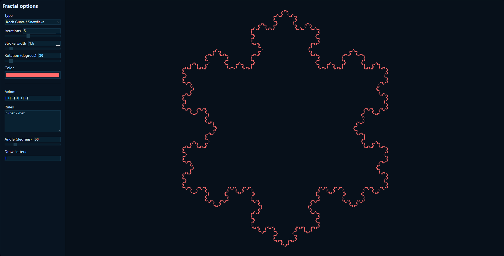

# Fractal Experiments



A Svelte-based web application for exploring and visualizing fractals with interactive controls and real-time rendering.

## Project Overview

This project provides an interactive environment for generating and experimenting with fractals. It features a modern UI built with Svelte and SvelteKit, allowing users to adjust parameters and see the results instantly.

It is a side project in early development.

It lags (and might freeze) with some fractals at high iterations, not necessarily due to the project's performance but because of the exponential growth of the fractals.

## Index

- [Fractal Experiments](#fractal-experiments)
  - [Project Overview](#project-overview)
  - [Index](#index)
  - [L-System Fractals](#l-system-fractals)
    - [Performance](#performance)
  - [Features](#features)
  - [Tech Stack](#tech-stack)
  - [Getting Started](#getting-started)
    - [Prerequisites](#prerequisites)
    - [Installation](#installation)
    - [Development](#development)
    - [Building](#building)
  - [Project Structure](#project-structure)

## L-System Fractals

The fractals drawn with this app are L-System fractals.

L-System fractals are defined by a few key components:

- **Axiom**: The starting string, e.g., `F` (meaning "draw forward").
- **Production Rules**: Rewriting rules for each symbol, e.g., `F → F+F-F-F+F` (replaces `F` with a more complex pattern).
- **Alphabet**: Symbols like `F` (forward), `+` (turn left), `-` (turn right), `[` (push state), `]` (pop state).
- **Iterations**: Number of times to apply rules, starting from the axiom.

Example for a simple tree:

- Axiom: `F`
- Rules: `F → F[+F]F[-F]F`

The F means that a segment is drawn.

For each iteration, each letter is replaced with its rule.

In this case, after 1 iteration, you can see that the tree is 3 segments long with 2 leaves.

The leaves are between brackets `[]`, meaning that after a leaf is drawn (at `]`), the algorithm goes back to where it began (at `[`) and keeps drawing.

You can adjust the rules and parameters to generate variations.

### Performance

L-Systems grow exponentially with each iteration because every symbol can expand into multiple symbols. This means both the generated string length and the number of drawn segments can explode quickly.

- Keep iterations low (start at 1–3; increase gradually)
- Prefer simpler rules (fewer `F` per rule; fewer branches `[]`)
- If the page feels slow or freezes, lower the iterations (preferred) or simplify the rules

## Features

- **Interactive Fractal Controls** - Adjust fractal parameters in real-time
- **Visual Feedback** - Instant rendering updates as you modify settings
- **Modular Components** - Well-organized atomic, molecular, and organism-based UI components

## Tech Stack

- **Framework**: Svelte + SvelteKit
- **Language**: TypeScript
- **Build Tool**: Vite
- **Package Manager**: pnpm

## Getting Started

### Prerequisites

- Node.js (v18+)
- pnpm

### Installation

```sh
# Install dependencies
pnpm install
```

### Development

Start the development server:

```sh
pnpm run dev

# Open in browser (optional)
pnpm run dev -- --open
```

The app will be available at `http://localhost:5173`

### Building

To create a production build:

```sh
pnpm run build
```

Preview the production build:

```sh
pnpm run preview
```

## Project Structure

```txt
src/
├── lib/
│   ├── components/       # Reusable UI components
│   │   ├── atoms/        # Basic components (Button, Input, etc.)
│   │   ├── molecules/    # Composite components (Controls)
│   │   └── organisms/    # Complex components (FractalControls)
│   ├── fractals.ts       # Fractal generation logic
├── routes/               # SvelteKit pages and layouts
└── app.css               # Global styles
```
